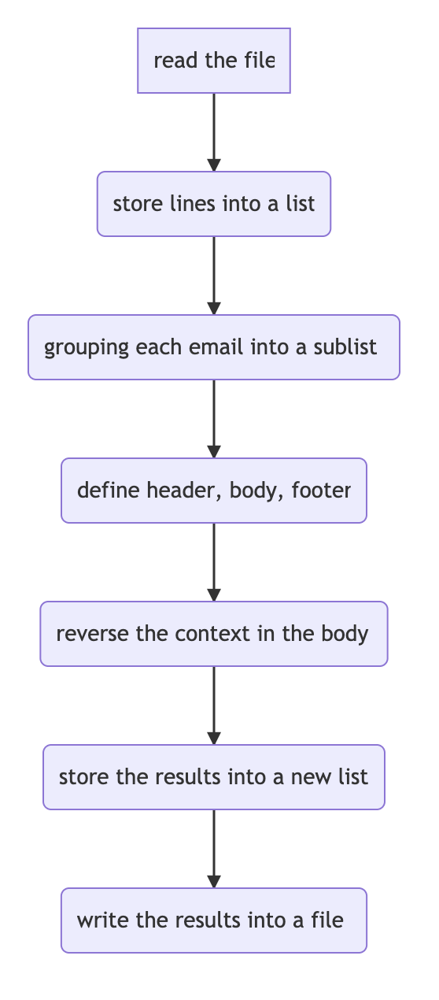

# mbox_challenge

* Program to reverse the content inside emails

* files in the repository
  * reverse_email.py: python program to reverse the email content
  * reverse_email.ipynb: jupyter notebook showing the process of programming
  * Resources Folder: original text file
     * mbox.full: text file using in the program
  * Results Folder:
     * reverse_email.txt: the text file the program reverse_email.py generated